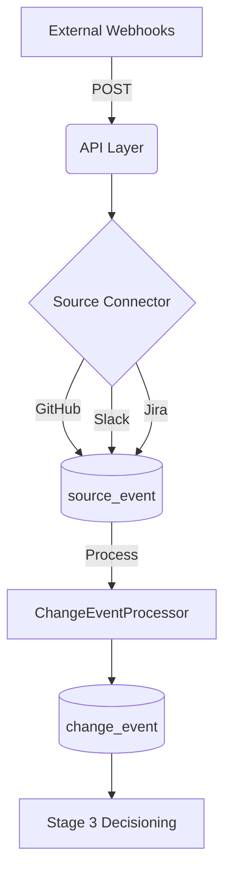

# Emiva Ingestion

A robust, Flask-based webhook ingestion service designed for high-integrity raw data collection and signal merging from **GitHub**, **Slack**, and **Jira**.

## 🚀 Features

-   **Multi-Source Ingestion**: Pre-configured, dedicated endpoints for GitHub, Slack, and Jira.
-   **UUID-Based Architecture**: High-collision resistance using UUIDs for all primary and foreign keys.
-   **Multi-Tenancy Support**: Built-in `workspace_id` for isolated data processing across organizations.
-   **Stage 2 Signal Merging**: Intelligent logic to link Jira issues, GitHub PRs, and Slack discussions.
-   **Automated Normalization**: Converts disparate JSON payloads into standard, queryable "Source Events".
-   **Direct Traceability**: Each `ChangeEvent` is directly linked to its primary trigger `SourceEvent`.
-   **Decoupled Architecture**: Separation of concerns between the API Layer, Service Layer, and Persistence Layer.

## 🏗️ Architecture & Workflow

The system operates in a three-stage pipeline to ensure data integrity and traceability.

### 1. Ingestion Stage (Real-time)
*   **API Layer (`main.py`)**: Receives high-frequency POST requests from external webhooks.
*   **Connector Layer (`connectors/`)**: Handles source-specific parsing (headers, payload formats) and initial validation.
*   **Source Table**: Saves every incoming signal into the `source_event` table for auditability.

### 2. Processing Stage (Async/Scheduled)
*   **Signal Merger (`services/change_event_processor.py`)**: Runs independently to scan unprocessed raw data.
*   **Entity Linking**: Uses Jira keys (e.g., `ENG-1001`) found in PR descriptions or Slack messages to group related information.
*   **Consolidation**: Stores the final, unified view of a change in the `change_event` table, linking it to the primary source event.

### 3. Decisioning Stage (Downstream)
*   The normalized `change_event` records serve as the primary input for Stage 3 logic (reporting, dashboards, or automation).



## 🛠️ Step-by-Step Setup

### 1. Environment Configuration
Create a virtual environment and install the required packages:
```bash
python -m venv venv
# Windows
.\venv\Scripts\activate
# Linux/Mac
source venv/bin/activate

pip install -r requirements.txt
```

### 2. Database Initialization
Ensure the database schema is initialized:
```bash
python -c "from database.db import init_db; init_db()"
```

### 3. Start Ingestion
Launch the Flask server to begin capturing webhooks:
```bash
python main.py
```

### 4. Process & Merge Signals
Run the processor to consolidate raw signals into Change Events:
```bash
python -m services.change_event_processor
```

## 🔍 Diagnostic Tools

The system includes pre-built scripts to monitor the data flow:

| Tool | Command | Description |
| :--- | :--- | :--- |
| **Source Viewer** | `python view_data.py` | Inspect the last 20 source events received. |
| **Change Viewer** | `python view_changes.py` | View the consolidated Change Events after processing. |

## 📁 Project Structure

- `connectors/`: Logic for parsing GitHub, Slack, and Jira payloads.
- `database/`: SQLAlchemy models (`SourceEvent`, `ChangeEvent`).
- `services/`: Business logic and processing (`webhook_service`, `change_event_processor`).
- `main.py`: Entry point for the Flask API.

## 📊 Sample Data Examples

### 1. Source Events (`source_event`)
Initial signals with UUIDs and workspace context.

| ID (UUID) | Source Type | Workspace ID | Created At |
| :--- | :--- | :--- | :--- |
| `e6a844...` | `jira` | `alpha-uuid` | 2026-03-18 14:00:00 |
| `36d9ea...` | `github` | `beta-uuid` | 2026-03-18 14:30:00 |

### 2. Consolidated Change Events (`change_event`)
High-integrity output with ticket metadata and direct source links.

| ID (UUID) | Type | Component | Title | Ticket ID |
| :--- | :--- | :--- | :--- | :--- |
| `06dc5c...` | `feature` | `Security` | [ENG-1000] Add per-user rate limiting | `ENG-1000` |
| `682703...` | `bug_fix` | `Mobile` | [ENG-1001] Fix login crash on iOS | `ENG-1001` |

---
Developed for the **EmivaAI Ingestion Pipeline**.
