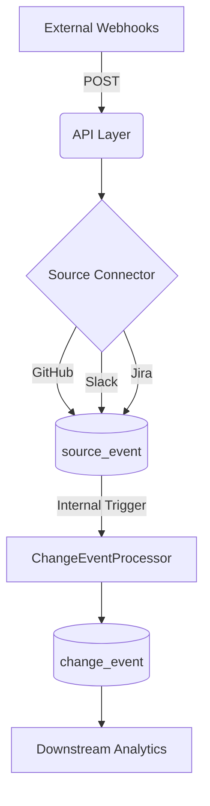

# Emiva Ingestion Pipeline

A high-performance, Flask-based webhook ingestion service designed for high-integrity data collection and automated signal merging from **GitHub**, **Slack**, and **Jira**.

## 🚀 Key Features

*   **Zero-Latency Processing**: Sources are automatically consolidated into Change Events the moment they are received.
*   **UUID-First Architecture**: Built for scale and collision resistance using UUIDs for all entity identifiers.
*   **Multi-Tenancy**: Native `workspace_id` support for isolated data streams.
*   **Intelligent Signal Merging**: Links Jira tickets, GitHub PRs, and Slack discussions into a single "Golden Record".
*   **Lossless Raw Storage**: Every incoming webhook is preserved in its raw state for full auditability.

## 🏗️ Technical Architecture

The system follows a streamlined, automated pipeline:

1.  **Capture**: Webhooks hit dedicated endpoints in `main.py`.
2.  **Persist**: The `source_event` table stores the raw payload and workspace context.
3.  **Merge (Auto)**: The `ChangeEventProcessor` is triggered instantly to link the new signal to existing or new `change_event` records.
4.  **Enrich**: Change events are populated with ticket titles, descriptions, and direct URLs for downstream use.



## 🛠️ Quick Start

### 1. Setup Environment
```bash
python -m venv venv
# Windows: .\venv\Scripts\activate | Linux: source venv/bin/activate
pip install -r requirements.txt
```

### 2. Initialize Database
```bash
python -c "from database.db import init_db; init_db()"
```

### 3. Start Ingesting
```bash
python main.py
```
> [!TIP]
> Use **ngrok** (`ngrok http 5000`) for local development to expose your server to the internet.

---

## 🔍 Tools & Inspection

| Command | Purpose |
| :--- | :--- |
| `python view_data.py` | Inspect the latest raw **Source Events**. |
| `python view_changes.py` | View the consolidated **Change Events**. |

## 📁 Project Structure

*   `connectors/`: Source-specific parsers (headers, payload routing).
*   `database/`: SQLAlchemy models and persistence logic.
*   `services/`: Core logic for webhook handling and signal consolidation.
*   `main.py`: Entry point for the Flask API.

## 📊 Output Examples

### Source Events (`source_event`)
| ID (UUID) | Source Type | Workspace ID | Created At |
| :--- | :--- | :--- | :--- |
| `e6a844...` | `jira` | `alpha-uuid` | 2026-03-18 14:00:00 |
| `36d9ea...` | `github` | `beta-uuid` | 2026-03-18 14:30:00 |

### Change Events (`change_event`)
| ID (UUID) | Type | Component | Title | Ticket ID |
| :--- | :--- | :--- | :--- | :--- |
| `06dc5c...` | `feature` | `Security` | [ENG-1000] Add per-user rate limiting | `ENG-1000` |
| `682703...` | `bug_fix` | `Mobile` | [ENG-1001] Fix login crash on iOS | `ENG-1001` |

---
Developed for the **EmivaAI Ingestion Pipeline**.
