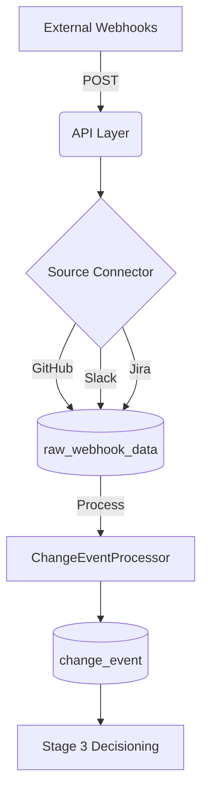

# Emiva Ingestion

A robust, Flask-based webhook ingestion service designed for high-integrity raw data collection and signal merging from **GitHub**, **Slack**, and **Jira**.

## 🚀 Features

-   **Multi-Source Ingestion**: Pre-configured, dedicated endpoints for GitHub, Slack, and Jira.
-   **Stage 2 Signal Merging**: Intelligent logic to link Jira issues, GitHub PRs, and Slack discussions.
-   **Automated Normalization**: Converts disparate JSON payloads into standard, queryable "Change Events".
-   **Smart Classification**: Uses regex and keyword mapping to categorize changes (e.g., `bug_fix`, `feature`, `chore`).
-   **Decoupled Architecture**: Separation of concerns between the API Layer, Service Layer, and Persistence Layer.

## 🏗️ Architecture & Workflow

The system operates in a three-stage pipeline to ensure data integrity and traceability.

### 1. Ingestion Stage (Real-time)
*   **API Layer (`main.py`)**: Receives high-frequency POST requests from external webhooks.
*   **Connector Layer (`connectors/`)**: Handles source-specific parsing (headers, payload formats) and initial validation.
*   **Raw Storage**: Saves every incoming signal into the `raw_webhook_data` table for auditability.

### 2. Processing Stage (Async/Scheduled)
*   **Signal Merger (`services/change_event_processor.py`)**: Runs independently to scan unprocessed raw data.
*   **Entity Linking**: Uses Jira keys (e.g., `EMIVA-123`) found in PR descriptions or Slack messages to group related information.
*   **Consolidation**: Stores the final, unified view of a change in the `change_event` table.

### 3. Decisioning Stage (Downstream)
*   The normalized `change_event` records serve as the primary input for Stage 3 logic (e.g., notifying stakeholders, triggering builds, or updating dashboards).



## 🛠️ Step-by-Step Setup

### 1. Environment Configuration
Create a virtual environment and install the required packages:
```bash
python -m venv venv
# Windows
.\venv\Scripts\activate
# Linux/Mac
source venv/bin/activate

pip install -r requirements.txt
```

### 2. Database Initialization
Ensure the database schema is initialized:
```bash
python -c "from database.db import init_db; init_db()"
```

### 3. Start Ingestion
Launch the Flask server to begin capturing webhooks:
```bash
python main.py
```
*Note: Use **ngrok** (`ngrok http 5000`) for local development to expose your local server to the internet.*

### 4. Process & Merge Signals
Run the processor to consolidate raw signals into Change Events:
```bash
python -m services.change_event_processor
```

## 🔍 Diagnostic Tools

The system includes pre-built scripts to monitor the data flow:

| Tool | Command | Description |
| :--- | :--- | :--- |
| **Raw Viewer** | `python view_data.py` | Inspect the last 20 raw webhook payloads received. |
| **Change Viewer** | `python view_changes.py` | View the consolidated Change Events after processing. |

## 📁 Project Structure

- `connectors/`: Logic for parsing GitHub, Slack, and Jira payloads.
- `database/`: SQLAlchemy models (`RawWebhookData`, `ChangeEvent`).
- `services/`: Business logic and processing (`webhook_service`, `change_event_processor`).
- `main.py`: Entry point for the Flask API.
- `config.py`: Environment-based configurations.

## 📊 Sample Data Examples

### 1. Raw Webhook Data (`raw_webhook_data`)
The initial signals captured from each source.

| Source | Event Type | Summary (from payload) | Received At |
| :--- | :--- | :--- | :--- |
| `jira` | `issue_updated` | Bug: Fix login crash on iOS | 2026-03-17 10:00:00 |
| `github` | `pull_request` | Fix for EMIVA-101: added null checks | 2026-03-17 10:30:00 |
| `slack` | `message` | Found the cause for EMIVA-101... | 2026-03-17 10:45:00 |
| `jira` | `issue_created` | Feature: Implement Magic Link Auth | 2026-03-17 11:00:00 |
| `github` | `pull_request` | feat: EMIVA-102 magic link... | 2026-03-17 11:15:00 |

### 2. Consolidated Change Events (`change_event`)
The high-integrity output after the `ChangeEventProcessor` merges related signals.

| Type | Component | Issues | Actors | Summary |
| :--- | :--- | :--- | :--- | :--- |
| `bug_fix` | `Mobile App` | `EMIVA-101` | `Dev Rajesh`, `rajesh_dev` | Fix login crash on iOS |
| `feature` | `Auth Service` | `EMIVA-102` | `Dev Rajesh`, `rajesh_dev` | Implement Magic Link Auth |
| `chore` | `Backend` | `EMIVA-103` | `Dev Rajesh` | Update API Documentation |
| `bug_fix` | `Infrastructure` | `EMIVA-104` | `Dev Rajesh` | Database connection leak |
| `feature` | `Frontend` | `EMIVA-105` | `Dev Rajesh` | Optimize Dashboard Queries |

---
Developed for the **EmivaAI Ingestion Pipeline**.
