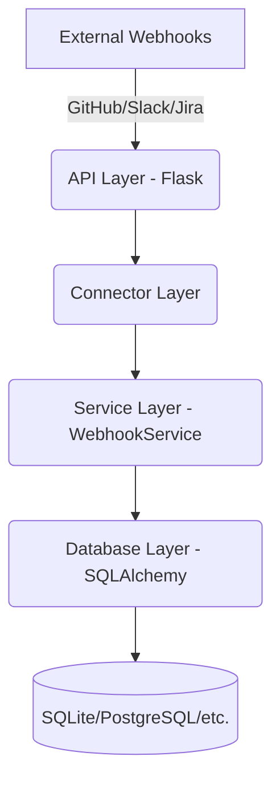

# Emiva Ingestion

A robust, Flask-based webhook ingestion service designed for high-integrity raw data collection from **GitHub**, **Slack**, and **Jira**. This service utilizes a decoupled service-layer architecture to ensure data persistence is handled independently of the API endpoints, allowing for future scalability and reliability.

## 🚀 Features

-   **Multi-Source Ingestion**: Pre-configured, dedicated endpoints for GitHub, Slack, and Jira webhooks.
-   **Decoupled Architecture**: Separation of concerns between the API Layer (Flask), Service Layer, and Database Layer (SQLAlchemy).
-   **Source-Specific Logic**: intelligent handling for varying webhook formats (e.g., Slack's URL verification challenge).
-   **Configurable Persistence**: Easily switch between database backends via the `DATABASE_URL` environment variable.
-   **Automatic Schema Initialization**: Database tables are automatically created on first run.
-   **Diagnostic Tooling**: Built-in CLI tool (`view_data.py`) for real-time inspection of ingested data.
-   **Health Monitoring**: `/health` endpoint for integration with monitoring systems.

## 🏗️ Architecture

The system follows a strict hierarchical data flow to ensure clean separation of business logic and data persistence:



-   **API Layer**: Receives HTTP POST requests and routes them to source-specific connectors.
-   **Connector Layer**: Parses headers and payloads to identify event types and extract relevant data.
-   **Service Layer**: Handles business logic, validation, and passes data to the persistence layer.
-   **Database Layer**: Manages SQLAlchemy models and database transactions.

## 🛠️ Prerequisites

-   Python 3.8+
-   `pip` (Python package installer)
-   [ngrok](https://ngrok.com/) (for local testing of live webhooks)

## 📦 Installation

1.  **Clone the repository**:
    ```bash
    git clone https://github.com/EmivaAI/emiva-ingestion.git
    cd emiva-ingestion
    ```

2.  **Create and activate a virtual environment**:
    ```bash
    # Windows
    python -m venv venv
    .\venv\Scripts\activate

    # Linux/MacOS
    python3 -m venv venv
    source venv/bin/activate
    ```

3.  **Install dependencies**:
    ```bash
    pip install -r requirements.txt
    ```

## ⚙️ Configuration

The application is configured using environment variables. You can set these in your shell or use a `.env` file (if supported by your runner).

| Variable | Description | Default |
| :--- | :--- | :--- |
| `DATABASE_URL` | SQLAlchemy connection string (Supports SQLite, PostgreSQL, etc.) | `sqlite:///.../ingestion.db` |
| `FLASK_DEBUG` | Enable/Disable Flask debug mode | `True` |

## 🏃 Usage

Start the Flask server:

```bash
python main.py
```

The server will start on `http://localhost:5000`.

### 🔍 Viewing Ingested Data

To inspect the latest 20 records stored in the database, use the built-in diagnostic tool:

```bash
python view_data.py
```

**Example Output:**
```text
ID    | Source     | Event Type           | Received At               | Payload
---------------------------------------------------------------------------------------------------------
1     | github     | push                 | 2026-03-16 12:00:00       | {'ref': 'refs/heads/main', ...}
2     | slack      | message              | 2026-03-16 12:05:00       | {'type': 'event_callback', ...}
```

## 🛣️ API Endpoints

| Endpoint | Method | Source | Header Requirements | Description |
| :--- | :--- | :--- | :--- | :--- |
| `/webhooks/github` | `POST` | GitHub | `X-GitHub-Event` | Collects repository events (push, pull_request, etc.) |
| `/webhooks/slack` | `POST` | Slack | N/A | Handles event subscriptions and URL verification |
| `/webhooks/jira` | `POST` | Jira | N/A | Captures issue updates, sprint changes, etc. |
| `/health` | `GET` | N/A | N/A | Returns `{"status": "healthy"}` |

## 📁 Project Structure

```text
emiva-ingestion/
├── connectors/         # Source-specific payload processing logic
│   ├── github_connector.py
│   ├── slack_connector.py
│   └── jira_connector.py
├── database/           # persistence layer
│   ├── db.py           # SQLAlchemy setup and RawWebhookData model
│   └── ingestion.db    # Default SQLite database (auto-generated)
├── services/           # Core business logic layer
│   └── webhook_service.py
├── config.py           # Environment-based configuration management
├── main.py             # Entry point and Flask route definitions
├── view_data.py        # CLI diagnostic tool for data inspection
├── requirements.txt    # List of Python dependencies
└── README.md           # Project documentation
```

## 🌐 Local Development with ngrok

To test live webhooks from GitHub, Slack, or Jira on your local machine:

1.  Start the Flask server (`python main.py`).
2.  In a new terminal, run ngrok:
    ```bash
    ngrok http 5000
    ```
3.  Copy the provided `https` URL (e.g., `https://a1b2c3d4.ngrok.app`).
4.  Configure your webhook in GitHub/Slack/Jira to point to `<your-ngrok-url>/webhooks/<source>`.

---

Developed as part of the **EmivaAI Ingestion Pipeline**.
